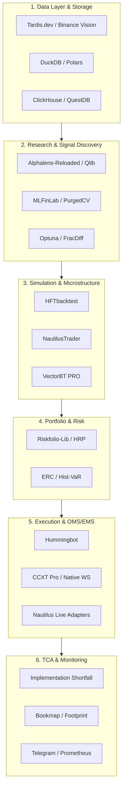

# Дослідження екосистеми інструментів квант- та HFT-трейдингу криптовалют (2024–2026)
## Аналіз відкритого та пропрієтарного ПЗ і практичні запозичення для `scalper-hft`

> **Документ підготовлено для проекту:** `scalper-hft`  
> **Базова філософія проекту:** Narang ("Inside the Black Box"), López de Prado ("Advances in Financial Machine Learning"), Binance USDT-M futures, maker fee edge (0.02%), сувора культура валідації без lookahead та overfit.

---

## 1. Вступ та системна таксономія інструментів

Кількісна торгівля деривативами на криптобіржах вимагає вирішення шести функціональних завдань:

---

## 2. Глибокий огляд Open-Source рішень

### 2.1. Рушії бектестингу та мікроструктурної симуляції

#### A. [HFTbacktest](https://github.com/nugget365/hftbacktest) (Rust / Python)
* **Архітектура:** Високопродуктивний рушій для симуляції L2/L3 стакану та стріму угод. Написаний на Rust із PyO3/CFFI біндингами для Python.
* **Ключова інновація:** **Queue Position Modeling (QPM)**. На відміну від 99% бектестерів, які вважають ордер виконаним, коли ціна просто торкнулася лімітки (`price <= limit`), HFTbacktest враховує:
  1. *Чергу заявок (FIFO)*: ордер встає за всіма заявками, що вже стояли на цьому ціновому рівні на момент виставлення (`queue_ahead`).
  2. *Мережеві затримки*: затримка надсилання ордера до біржі ($t_{send}$) та отримання підтвердження ($t_{ack}$).
  3. *Cancel/Replace латентність*: якщо стратегія переставляє ордер, вона втрачає пріоритет у черзі.
* **Цінність для нас:** Дозволяє виявити **Adverse Selection** — ситуацію, коли лімітку виконують лише тоді, коли токсичний потік ринкових ордерів пробиває стакан проти нас.

#### B. [NautilusTrader](https://github.com/nautechsystems/nautilus_trader) (Rust + Cython/Python)
* **Архітектура:** Повноцінна виробнича платформа (production-grade algorithmic trading platform). Наносекундні мітки часу, event-driven ядра на Rust, повна типізація, підтримка OMS/EMS.
* **Сильні сторони:**
  - Готовий адаптер до Binance USDT-M Futures (як для бектесту, так і для live торгівлі через єдиний інтерфейс).
  - Підтримка складних типів ордерів (Post-Only, FOK, IOC, Icebergs).
  - Детерміністичний бектест: ідентична поведінка на історичних та живих подіях.
* **Недоліки:** Дуже високий поріг входу, складна об'єктна модель, складність швидкого векторизованого скринінгу гіпотез.

#### C. [VectorBT PRO](https://vectorbt.pro/) / [VectorBT](https://github.com/polakowo/vectorbt) (Python / Numba)
* **Архітектура:** Векторизована симуляція через масиви NumPy та Numba-компіляцію.
* **Сильні сторони:** Найшвидший у світі інструмент для попереднього скринінгу параметрів (grid search, random search, walk-forward). Здатний перебирати десятки тисяч комбінацій сигналів за секунди.
* **Обмеження:** Векторизація принципово не здатна змоделювати внутрішньобарну чергу стакану, часткові виконання або динаміку ліквідності L2.

#### D. [Hummingbot](https://github.com/hummingbot/hummingbot) (Python / Cython)
* **Архітектура:** Платформа, сфокусована суто на крипто-маркет-мейкінгу та арбітражі.
* **Сильні сторони:**
  - Реалізовані алгоритми класичного маркет-мейкінгу: Avellaneda-Stoikov, Pure Market Making, Cross-Exchange Market Making.
  - V2 Controller Architecture: розділення логіки на Data Feed, Controller (альфа-рішення) та Execution Executor (керування життєвим циклом ліміток).
  - Підтримка шорт/лонг перпів та автоматичного хеджування.
* **Недоліки:** Практично відсутній науковий статистичний бектестер (відсутній аналіз deflated Sharpe, CPCV тощо).

#### E. [Freqtrade + FreqAI](https://github.com/freqtrade/freqtrade) (Python)
* **Архітектура:** Популярний retail-фреймворк для свічкових стратегій.
* **Сильні сторони:**
  - **FreqAI**: конвеєр для ковзного навчання ML-моделей (LightGBM, XGBoost, CatBoost, PyTorch) із захистом від lookahead.
  - Розвинені модулі захисту капіталу (MaxDrawdownProtection, StoplossGuard, LowProfitPairs).
  - Багата екосистема сповіщень та інтерфейсів (Telegram, UI API).
* **Обмеження:** Зав'язаний на OHLCV свічки; непридатний для субсекундного аналізу стакану.

#### F. [Qlib (Microsoft)](https://github.com/microsoft/qlib) (Python / C++)
* **Архітектура:** ШІ-орієнтована платформа для кількісних інвестицій.
* **Сильні сторони:** Повноцінна інфраструктура для генерації факторів (Alpha158, Alpha360), обчислення Information Coefficient (IC, Rank IC), автоматичний вибір моделей (DoubleEnsemble, GBDT, Temporal Models).
* **Обмеження:** Спроєктований під фондовий ринок (щоденні бари), вимагає значної адаптації під мікроструктуру крипти.

---

### 2.2. Факторний аналіз, анти-перенавчання та портфельний ризик

| Бібліотека | Спеціалізація | Архітектурні переваги |
|---|---|---|
| **[Alphalens-Reloaded](https://github.com/quantopian/alphalens)** | Дослідження альфа-факторів | Генерація стандартизованих tearsheets: Information Coefficient (IC), Rank IC, IC Decay (швидкість згасання сигналу за лагами), перевірка монотонності квантилів. |
| **[Riskfolio-Lib](https://github.com/dcajasn/Riskfolio-Lib)** | Сучасна оптимізація портфелів | **Hierarchical Risk Parity (HRP)**, HERC, Nested Clustered Optimization (NCO). Усуває проблему інверсії сингулярних коваріаційних матриць Марковіца у крипті. |
| **[MLFinLab](https://github.com/hudson-and-thames/mlfinlab)** | Квантова інженерія за López de Prado | Triple Barrier розпаралелювання, зважування семплів за часовим перекриттям (sample uniqueness), Combinatorial Purged CV (CPCV). |
| **[QuantStats](https://github.com/ranaroussi/quantstats)** | Оцінка метрик прибутковості | Генерація комплексного HTML/Jupyter звіту за один виклик (Tail Ratio, Calmar, VaR/CVaR, Underwater plot, EO-stats). |

---

### 2.3. Високопродуктивна аналітика тікових даних (Data Layer)

1. **[DuckDB](https://duckdb.org/)**:
   - Вбудована колонкова база даних без необхідності підняття окремого сервера.
   - Миттєво читає Parquet безпосередньо з диска без повного завантаження в RAM.
   - **`ASOF JOIN`**: нативний SQL-оператор для злиття несинхронних часових рядів (наприклад, прив'язка останнього значення `funding_rate` або `bookTicker` до кожної угоди/свічки без ризику lookahead bias).
2. **[Polars](https://pola.rs/)**:
   - Багатопотокова бібліотека DataFrames на Rust.
   - Швидкість розрахунку технічних та мікроструктурних фічей у 10–30 разів вища за Pandas.

---

## 3. Огляд індустріальних та комерційних рішень

### 3.1. Візуалізація мікроструктури та Order Flow
* **[Bookmap](https://bookmap.com/)**: Світовий стандарт візуалізації L2/L3 даних. Відображає динамічну теплову карту стакану глибиною в тисячі рівнів, показуючи спуфінг, накопичення ліквідності та поглинання айсбергів.
* **[Exocharts](https://exocharts.com/) / [ATAS](https://atas.net/) / [Sierra Chart](https://sierrachart.com/)**: Інструменти аналізу Footprint, горизонтального обсягу (Volume Profile), Cumulative Volume Delta (CVD) та розподілу ліквідності на кожному ціновому рівні (Price x Volume x Delta).

### 3.2. Ринкові агрегатори та постачальники інституційних даних
* **[Tardis.dev](https://tardis.dev/)**: Стандарт серед крипто-квантів. Забезпечує доступ до історичних L2/L3 снапшотів, bookTicker, liquidations та трейдів з точністю до мікросекунд біржових серверів.
* **[Velo Data](https://velodata.app/) & [CoinGlass](https://www.coinglass.com/)**: Спеціалізовані платформи для моніторингу відкритих деривативних метрик: теплова карта фандінгу по всіх біржах, ліквідаційні пули, співвідношення лонг/шорт, базис (Spot vs Futures).
* **[Kaiko](https://www.kaiko.com/) & [Amberdata](https://www.amberdata.io/)**: Інституційні вендори нормалізованих даних стаканів, спредів та крос-біржової ліквідності.

### 3.3. Institutional Tick Stores & Analytics
* **[Kx kdb+ / q](https://kx.com/)**: Найшвидша векторна база даних на Уолл-стріт, стандарт серед тікових HFT-фондів (Jane Street, Jump, Citadel).
* **[DolphinDB](https://dolphindb.com/)**: Сучасний аналог kdb+ із вбудованим рушієм потокових обчислень (Streaming Engine) та мовою синтаксису Python/SQL.

---

## 4. Порівняльний GAP-аналіз із поточною кодовою базою `scalper-hft`

| Критерій | Стан у `scalper-hft` | Стан у топових рішеннях (HFTbacktest, Nautilus, Qlib, Riskfolio) | Оцінка прогалини (GAP) |
|---|---|---|---|
| **Валідація & Анти-перенавчання** | Провідний рівень: Purged CV, CPCV, Deflated Sharpe, Holdout burn registry, CSCV/PBO. | Аналогічно (MLFinLab, PurgedCV). | **Відсутня (Проєкт на рівні кращих світових стандартів)** |
| **TCA & Модель витрат** | Єдиний `CostModel`, vol-aware slippage, sqrt-impact, Implementation Shortfall (IS) звіт у paper. | Nautilus/HFTbacktest: субсекундний slip, queue-aware fill. | **Мінімальна**: бракує обліку черги стакану на рівні ліміток. |
| **Аналіз факторів (Alpha Tearsheet)** | Розрізнені квантильні тести, z-score, time-decay аудити. | Alphalens/Qlib: єдиний Information Coefficient (IC) pipeline з decay half-life. | **Середня**: витрачається час на повний бектест замість швидкого тесту сили альфи. |
| **Симуляція виконання ліміток (Maker)** | Барні перевірки (touch, high/low), micro-price. | HFTbacktest: повна симуляція черги (Queue Position Model), FIFO volume depletion. | **Висока для HFT / Низька для 1h MFT**: для 1h maker потрібна оцінка touch-vs-fill. |
| **Портфельний ризик мульти-пар** | ERC (Equal Risk Contribution), Hist-VaR 95%, Vol-targeting. | Riskfolio-Lib: Hierarchical Risk Parity (HRP), коваріаційна кластеризація. | **Середня**: HRP критично спростить перехід до кошика 3–5 пар. |
| **Швидкість обробки тіків / L2 даних** | Pandas, PyArrow, SQLite. | DuckDB, Polars, ClickHouse. | **Середня**: Pandas перевантажує RAM при роботі з гігабайтами bookTicker. |

---

## 5. Стратегічні рекомендації для впровадження у `scalper-hft`

Враховуючи суворе правило проекту:
> *"Жодних нових стратегій і жодного live з реальними коштами, доки Wave 0 + Ops (8 тижнів paper LINK/BTC) не закриті"*

Всі впровадження повинні здійснюватися **паралельно**, не зачіпаючи бойовий цикл paper-трейдера на VPS, і ділитися на 3 послідовні фази.

### Топ-4 запозичення, що дадуть максимальну віддачу (ROI):

1. **Factor IC & Alpha Decay Engine** (ідеї `Alphalens` / `Qlib`):
   - Швидкий аналіз будь-якої нової сирої фічі/сигналу через Information Coefficient (IC) та Rank IC за лагами (1h, 2h, 4h, 8h, 24h).
   - Розрахунок періоду напіврозпаду сигналу (alpha half-life).
   - Забезпечує миттєве відсіювання шуму без запуску важкого бектесту та Optuna.

2. **DuckDB In-Memory & Parquet Analytical Helper** (сучасний Quant Data Stack):
   - Легковажна інтеграція для дослідження великих масивів `bookTicker` та `depth5`.
   - Забезпечення миттєвих `ASOF JOIN` для об'єднання klines, funding rates та стаканів без ризику lookahead bias.

3. **Hierarchical Risk Parity (HRP)** (ідеї `Riskfolio-Lib` / López de Prado):
   - Розширення модуля `scalper_hft/portfolio/`.
   - Підготовка до запуску Wave 2 (кошик із кількох некорельованих пар) без небезпеки виродження коваріаційної матриці.

4. **Queue Position Touch-vs-Fill Model** (ідеї `HFTbacktest`):
   - Утиліта для постобробки записаного на VPS потоку `bookTicker`.
   - Оцінка реальної ймовірності виконання лімітного ордера при торканні ціни залежно від обсягу в стакані.
